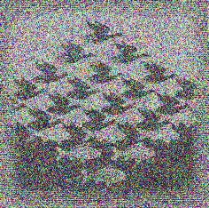

# Genetic-Algorithm-Image-Processing
Using a genetic algorithm to produce a target input image from scratch. Done in C

Usage (linux terminal): ./evolve [input file].ppm [output file].ppm [number of generations] [mutation rate]

There are also addition image files for testing purposes as well as some addtitional memory usage checking files

## Example

### Target

### Image Reconstruction

